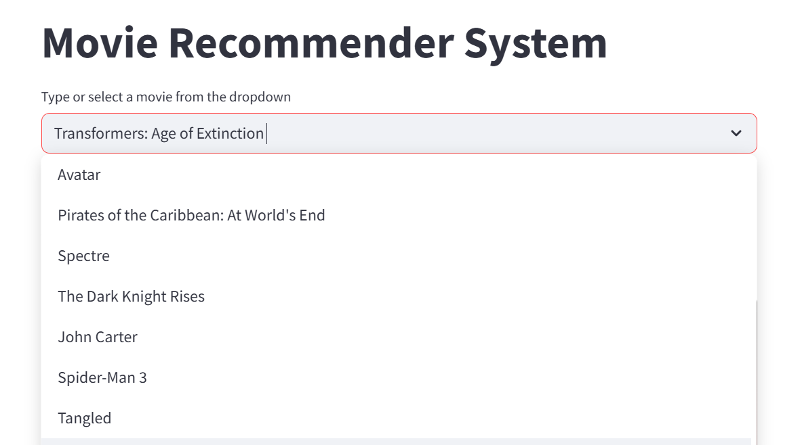
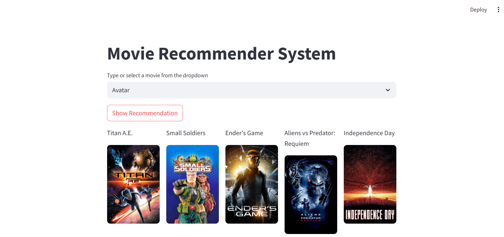

# Movie Recommender System

This is a Machine Learning based Movie Recommender System built using Python and Streamlit.

## Features
- Recommends similar movies
- Uses cosine similarity
- Interactive Streamlit web app
- TMDB movie poster integration

## Technologies Used
- Python
- Pandas
- NumPy
- Scikit-learn
- Streamlit

## Files
- app.py
- notebook.ipynb
- movie_list.pkl
- similarity.pkl


## How to Run

```bash
pip install -r requirements.txt
streamlit run app.py
```

## Environment Variable

Create a `.env` file and add:


TMDB_API_KEY=your_api_key_here


## Screenshots

### Homepage


### Movie Selection


### Recommendations

